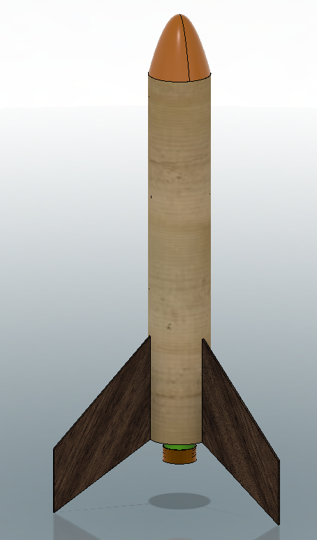

[](https://github.com/marketplace/actions/super-linter)




# Abhay Mathur Rockets


### Overview

This project contains the software, rocket simulations, and a backup of the CAD models of hardware for Abhay's Rockets

### Software

Under ```Arduino/``` is the code for different iterations of the rockets with different sensors/processors

### Hardware

Under ```Hardware/``` is all the CAD files of hardware from all iterations. Under ```Hardware/Hardware``` is the current hardware used

Under ```Hardware/Electronics``` is all the CAD files for electronics

*Note: All CAD files are exported from Autodesk Fusion 360 and are probably not up to date

### Simulation

Under ```OpenRocketSims/``` is the [Open Rocket](https://openrocket.info/) simulations for recent iterations of rockets

### Media

Under ```Media/``` are videos and pictures of different components of the rocket as well as a sample launch
